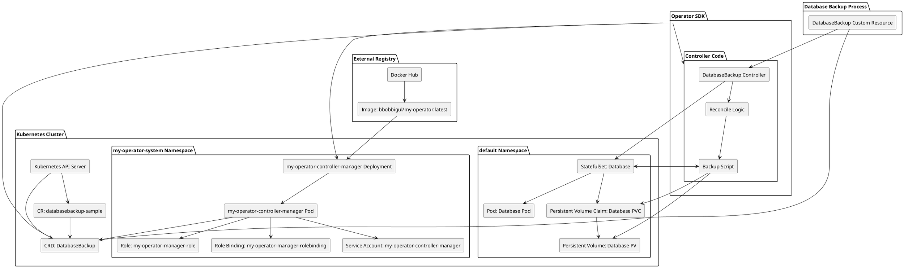

# my-operator

* 이 프로젝트는 쿠버네티스에 operator를 개발해보기 위해 무작정 해본 프로젝트

## 환경

* Windows
* Docker Desktop + Kubernetes + WSL
* go 1.21.11
* operator-sdk 1.35.0

## 시나리오

### 데이터베이스 백업 관리

* 가상의 회사 "매탄 네트워크"는 Kubernetes 클러스터에서 여러 데이터베이스를 운영 중
* 이 회사는 데이터베이스 백업을 자동화하고 관리하기 위해 Kubernetes 오퍼레이터를 사용하려고 함
* 현재 수동으로 각 데이터베이스를 백업하고, 백업 파일을 저장하고, 주기적으로 백업을 검증 중
* 이를 자동화하기 위해 "DatabaseBackup"이라는 새로운 Custom Resource Definition (CRD)을 정의하고, 이 CRD를 관리하는 오퍼레이터를 개발하려고 함

### 배포 시 구조




## 과정

### Operator SDK로 오퍼레이터 작성

#### 1. GitHub 리포지토리 생성

GitHub에 `my-operator`라는 새 리포지토리를 생성

#### 2. Operator SDK 설치 (Windows WSL 환경)

```sh
export ARCH=$(case $(uname -m) in x86_64) echo -n amd64 ;; aarch64) echo -n arm64 ;; *) echo -n $(uname -m) ;; esac)
export OS=$(uname | awk '{print tolower($0)}')
export OPERATOR_SDK_DL_URL=https://github.com/operator-framework/operator-sdk/releases/download/v1.35.0
curl -LO ${OPERATOR_SDK_DL_URL}/operator-sdk_${OS}_${ARCH}
chmod +x operator-sdk_${OS}_${ARCH} && sudo mv operator-sdk_${OS}_${ARCH} /usr/local/bin/operator-sdk
```

#### 3. 새로운 오퍼레이터 프로젝트 생성

```sh
mkdir my-operator
cd my-operator
operator-sdk init --domain test.io --repo github.com/leeminki/my-operator
```

* `--domain test.io`
  * 도메인은 CRD를 구분하고 네임스페이스를 정리하기 위해 사용
  * 일반적으로 조직이나 프로젝트를 식별할 수 있는 도메인
  * 예: `test.io`는 `apiVersion`에 포함되어 CRD의 고유성 보장
    * `apiVersion: databases.test.io/v1`

* `--repo github.com/leeminki/my-operator`
  * 리포지토리 경로로 Go 모듈의 경로 지정
  * 이 값은 코드 내에서 패키지를 가져올 때 사용
  * 예: `github.com/leeminki/my-operator`는 GitHub에서 프로젝트를 호스팅하는 경로

#### 4. API 및 컨트롤러 생성

```sh
operator-sdk create api --group databases --version v1 --kind DatabaseBackup --resource --controller
```

* `--group databases`
  * **그룹 이름**: CRD를 그룹화하는 데 사용
  * 그룹은 API 그룹을 정의하며, 일반적으로 도메인과 함께 사용
  * 예: `databases` 그룹은 데이터베이스 관련 리소스를 그룹화하는 데 사용
    * `apiVersion: databases.test.io/v1`

* `--version v1`
  * **API 버전**: CRD의 버전을 정의
  * 일반적으로 `v1alpha1`, `v1beta1`, `v1` 등의 형태로 사용
  * 예: `v1`은 안정적인 첫 번째 버전을 의미

* `--kind DatabaseBackup`
  * **리소스 종류**: 새로운 커스텀 리소스의 종류를 정의
  * CRD의 `kind` 필드에 사용
  * 예: `DatabaseBackup`은 데이터베이스 백업을 나타내는 리소스

* `--resource`
  * **리소스 생성 플래그**: 이 플래그를 사용하면 CRD 스키마와 관련 코드가 생성됨
  * 이 플래그를 설정하면 `api/v1/databasebackup_types.go` 파일이 생성됨

* `--controller`
  * **컨트롤러 생성 플래그**: 이 플래그를 사용하면 리소스를 관리하는 컨트롤러 코드가 생성됨
  * 이 플래그를 설정하면 `controllers/databasebackup_controller.go` 파일이 생성됨

##### 4.1. `api/v1/databasebackup_types.go`

* CRD 스키마를 정의하는 파일
* 이 파일에서 `DatabaseBackup` 리소스의 `Spec`과 `Status`를 정의

##### 4.2. `controllers/databasebackup_controller.go`

* CRD를 관리하는 컨트롤러 코드
* 이 파일에서 `DatabaseBackup` 리소스의 생성, 업데이트, 삭제 시 필요한 로직을 구현

### 프로젝트 구조 설명

#### 4.3. 프로젝트 구조 설명

```bash
.
├── Dockerfile
├── Makefile
├── PROJECT
├── README.md
├── api
│   └── v1
│       ├── databasebackup_types.go
│       ├── groupversion_info.go
│       └── zz_generated.deepcopy.go
├── bin
│   └── controller-gen
├── cmd
│   └── main.go
├── config
│   ├── crd
│   │   ├── kustomization.yaml
│   │   └── kustomizeconfig.yaml
│   ├── default
│   │   ├── kustomization.yaml
│   │   ├── manager_auth_proxy_patch.yaml
│   │   └── manager_config_patch.yaml
│   ├── manager
│   │   ├── kustomization.yaml
│   │   └── manager.yaml
│   ├── manifests
│   │   └── kustomization.yaml
│   ├── prometheus
│   │   ├── kustomization.yaml
│   │   └── monitor.yaml
│   ├── rbac
│   │   ├── auth_proxy_client_clusterrole.yaml
│   │   ├── auth_proxy_role.yaml
│   │   ├── auth_proxy_role_binding.yaml
│   │   ├── auth_proxy_service.yaml
│   │   ├── databasebackup_editor_role.yaml
│   │   ├── databasebackup_viewer_role.yaml
│   │   ├── kustomization.yaml
│   │   ├── leader_election_role.yaml
│   │   ├── leader_election_role_binding.yaml
│   │   ├── role.yaml
│   │   ├── role_binding.yaml
│   │   └── service_account.yaml
│   ├── samples
│   │   ├── databases_v1_databasebackup.yaml
│   │   └── kustomization.yaml
│   └── scorecard
│       ├── bases
│       │   └── config.yaml
│       ├── kustomization.yaml
│       └── patches
│           ├── basic.config.yaml
│           └── olm.config.yaml
├── go.mod
├── go.sum
├── hack
│   └── boilerplate.go.txt
├── internal
│   └── controller
│       ├── databasebackup_controller.go
│       ├── databasebackup_controller_test.go
│       └── suite_test.go
└── test
    ├── e2e
    │   ├── e2e_suite_test.go
    │   └── e2e_test.go
    └── utils
        └── utils.go
```

##### 4.3.1. 각 파일 및 디렉토리의 역할

###### 루트 디렉토리

* `Dockerfile`
  * 컨테이너 이미지를 빌드하기 위한 설정 파일
  * 오퍼레이터의 컨테이너 이미지를 만들 때 사용됨
* `Makefile`
  * 빌드, 테스트, 배포 등의 작업을 자동화하기 위한 설정 파일
  * `make` 명령어로 사용
* `PROJECT`
  * 프로젝트 메타데이터를 정의하는 파일
  * Operator SDK에서 사용하는 프로젝트 설정이 포함
* `README.md`
  * 프로젝트에 대한 설명과 사용 방법 등을 문서화한 파일
* `go.mod`
  * Go 모듈 파일로, 프로젝트의 종속성과 모듈 정보를 관리
* `go.sum`
  * `go.mod` 파일에 명시된 종속성의 체크섬 정보를 포함

###### `cmd` 디렉토리

* `main.go`
  * 오퍼레이터의 진입점 파일 메인 함수가 정의되어 있음
  * 오퍼레이터의 초기화와 실행이 이 파일에서 이루어짐

###### `api/v1` 디렉토리

* `databasebackup_types.go`
  * CRD의 스키마를 정의하는 파일
  * `DatabaseBackup` 리소스의 `Spec`과 `Status` 구조체가 이 파일에 정의됨
* `groupversion_info.go`
  * API 그룹과 버전을 정의하는 파일
  * 이 파일은 CRD가 속한 그룹과 버전을 Kubernetes에 등록
* `zz_generated.deepcopy.go`
  * 쿠버네티스 코드 생성 도구가 자동으로 생성하는 파일
  * `deepcopy` 함수들을 포함하고 있으며 각 커스텀 리소스의 구조체에 대해 deep copy를 수행하는 메서드 수행

###### `bin` 디렉토리

* `controller-gen`
  * 쿠버네티스 코드 생성 바이너리

###### `config` 디렉토리

* `crd`
  * CRD 정의와 관련된 Kubernetes 리소스 파일들이 포함된 디렉토리
  * `kustomization.yaml`
    * Kustomize 설정 파일로, CRD 관련 리소스의 패치를 정의
  * `kustomizeconfig.yaml`
    * Kustomize 설정 파일로, 특정 필드의 동작을 조정

* `default`
  * 기본 설정 파일들이 포함된 디렉토리
  * `kustomization.yaml`
    * 기본 설정을 위한 Kustomize 파일
  * `manager_auth_proxy_patch.yaml`
    * 매니저 인증 프록시 설정 패치
  * `manager_config_patch.yaml`
    * 매니저 설정 패치 파일

* `manager`
  * 매니저 관련 설정 파일들이 포함된 디렉토리
  * `kustomization.yaml`
    * 매니저 설정을 위한 Kustomize 파일
  * `manager.yaml`
    * 매니저의 배포 설정 파일

* `manifests`
  * 전체 매니페스트 파일들이 포함된 디렉토리
  * `kustomization.yaml`
    * 매니페스트 설정을 위한 Kustomize 파일

* `prometheus`
  * Prometheus 관련 설정 파일들이 포함된 디렉토리
  * `kustomization.yaml`
    * Prometheus 설정을 위한 Kustomize 파일
  * `monitor.yaml`
    * Prometheus 모니터 설정 파일

* `rbac`
  * 역할 기반 접근 제어(RBAC) 설정 파일들이 포함된 디렉토리
  * 다양한 역할, 역할 바인딩, 서비스 계정 관련 설정 파일들이 있음
  * `auth_proxy_client_clusterrole.yaml`
    * 인증 프록시 클라이언트 클러스터 역할 설정
  * `auth_proxy_role.yaml`
    * 인증 프록시 역할 설정
  * `auth_proxy_role_binding.yaml`
    * 인증 프록시 역할 바인딩 설정
  * `auth_proxy_service.yaml`
    * 인증 프록시 서비스 설정
  * `databasebackup_editor_role.yaml`
    * DatabaseBackup 리소스의 에디터 역할 설정
  * `databasebackup_viewer_role.yaml`
    * DatabaseBackup 리소스의 뷰어 역할 설정
  * `kustomization.yaml`
    * RBAC 설정을 위한 Kustomize 파일
  * `leader_election_role.yaml`
    * 리더 선출 역할 설정
  * `leader_election_role_binding.yaml`
    * 리더 선출 역할 바인딩 설정
  * `role.yaml`
    * 역할 설정 파일
  * `role_binding.yaml`
    * 역할 바인딩 설정 파일
  * `service_account.yaml`
    * 서비스 계정 설정 파일

* `samples`
  * 샘플 CR 파일들이 포함된 디렉토리
  * `databases_v1_databasebackup.yaml`
    * DatabaseBackup 리소스의 샘플 YAML 파일
  * `kustomization.yaml`
    * 샘플 설정을 위한 Kustomize 파일

* `scorecard`
  * 오퍼레이터의 테스트와 검증을 위한 설정 파일들이 포함된 디렉토리
  * `bases`
    * 기본 설정 파일이 포함된 디렉토리
    * `config.yaml`
      * 기본 설정 파일
  * `kustomization.yaml`
    * 스코어카드 설정을 위한 Kustomize 파일
  * `patches`
    * 추가 설정 패치 파일들이 포함된 디렉토리
    * `basic.config.yaml`
      * 기본 설정 패치 파일
    * `olm.config.yaml`
      * OLM 설정 패치 파일

###### `internal/controller` 디렉토리

* `databasebackup_controller.go`
  * 컨트롤러 로직을 정의하는 파일
  * `DatabaseBackup` 리소스의 생성, 업데이트, 삭제 시 필요한 로직을 구현
* `databasebackup_controller_test.go`
  * `DatabaseBackup` 컨트롤러의 테스트 파일
* `suite_test.go`
  * 테스트 스위트 파일. 오퍼레이터의 테스트를 위해 사용

###### `hack` 디렉토리

* `boilerplate.go.txt`
  * 코드 생성 시 사용할 보일러플레이트(기본 템플릿) 파일

###### `test` 디렉토리

* `e2e`
  * End-to-End 테스트 파일들이 포함된 디렉토리
  * `e2e_suite_test.go`
    * E2E 테스트 스위트 파일
  * `e2e_test.go`
    * E2E 테스트 파일
* `utils`
  * 유틸리티 파일들이 포함된 디렉토리
  * `utils.go`
    * 유틸리티 함수 정의 파일

### 5. CRD 및 컨트롤러 코드 작성

* `api/v1/databasebackup_types.go`와 `controllers/databasebackup_controller.go` 파일을 작성

#### 5.1 `api/v1/databasebackup_types.go`

```go
package v1

import (
	metav1 "k8s.io/apimachinery/pkg/apis/meta/v1"
)

// DatabaseBackupSpec는 DatabaseBackup 리소스의 원하는 상태를 정의
type DatabaseBackupSpec struct {
	// 데이터베이스 이름
	DatabaseName string `json:"databaseName,omitempty"`
	// 백업 일정 (cron 형식)
	Schedule string `json:"schedule,omitempty"`
	// 백업 파일을 저장할 경로
	BackupPath string `json:"backupPath,omitempty"`
}

// DatabaseBackupStatus는 DatabaseBackup 리소스의 현재 상태를 정의
type DatabaseBackupStatus struct {
	// 마지막 백업 시간이 기록
	LastBackupTime metav1.Time `json:"lastBackupTime,omitempty"`
    // 백업 진행여부 기록
    InProgress     bool        `json:"inProgress,omitempty"`
}

//+kubebuilder:object:root=true
//+kubebuilder:subresource:status
//+kubebuilder:resource:shortName=dbb
//+kubebuilder:printcolumn:name="Database",type=string,JSONPath=".spec.databaseName",description="The name of the database"
//+kubebuilder:printcolumn:name="Schedule",type=string,JSONPath=".spec.schedule",description="Backup schedule"
//+kubebuilder:printcolumn:name="Last Backup",type=date,JSONPath=".status.lastBackupTime",description="The last time the backup was run"

// DatabaseBackup은 DatabaseBackup API의 스키마
type DatabaseBackup struct {
	// API의 타입 메타데이터를 포함
	metav1.TypeMeta `json:",inline"`
	// 오브젝트 메타데이터를 포함 (이름, 네임스페이스, 레이블 등).
	metav1.ObjectMeta `json:"metadata,omitempty"`

	// 사용자가 설정하는 원하는 상태 (spec)를 포함
	Spec DatabaseBackupSpec `json:"spec,omitempty"`
	// 오퍼레이터가 관리하는 현재 상태 (status)를 포함
	Status DatabaseBackupStatus `json:"status,omitempty"`
}

// +kubebuilder:object:root=true

// DatabaseBackupList는 여러 DatabaseBackup 리소스를 포함하는 리스트
type DatabaseBackupList struct {
	metav1.TypeMeta `json:",inline"`
	metav1.ListMeta `json:"metadata,omitempty"`
	Items           []DatabaseBackup `json:"items"`
}

func init() {
	// DatabaseBackup와 DatabaseBackupList 타입을 스키마에 등록
	SchemeBuilder.Register(&DatabaseBackup{}, &DatabaseBackupList{})
}
```

#### 5.2 `internal/controller/databasebackup_controller.go`

```go
package controller

import (
	"context"
	"fmt"
	"time"

	"k8s.io/apimachinery/pkg/api/errors"
	"k8s.io/apimachinery/pkg/runtime"
	metav1 "k8s.io/apimachinery/pkg/apis/meta/v1"
	ctrl "sigs.k8s.io/controller-runtime"
	"sigs.k8s.io/controller-runtime/pkg/client"
	"sigs.k8s.io/controller-runtime/pkg/log"

	databasesv1 "github.com/leeminki/my-operator/api/v1"
)

// DatabaseBackupReconciler는 DatabaseBackup 객체를 관리하는 컨트롤러
type DatabaseBackupReconciler struct {
	client.Client
	Scheme *runtime.Scheme
}

// Reconcile 함수는 DatabaseBackup 객체의 상태를 읽고 변경 사항을 반영
func (r *DatabaseBackupReconciler) Reconcile(ctx context.Context, req ctrl.Request) (ctrl.Result, error) {
    log := log.FromContext(ctx)

    // DatabaseBackup 인스턴스를 가져옴
    backup := &databasesv1.DatabaseBackup{}
    err := r.Get(ctx, req.NamespacedName, backup)
    if err != nil {
        if errors.IsNotFound(err) {
            // DatabaseBackup 리소스를 찾을 수 없는 경우, 삭제된 것으로 간주하고 처리하지 않음
            return ctrl.Result{}, nil
        }
        // 리소스를 읽는 도중 에러가 발생한 경우, 재시도를 위해 에러를 반환
        return ctrl.Result{}, err
    }

    // 백업 작업이 이미 진행 중인지 확인
    if backup.Status.InProgress {
        // 이미 백업 작업이 진행 중인 경우, 재시도하지 않음
        return ctrl.Result{}, nil
    }

    // 백업 작업을 시작할 때 InProgress 상태를 true로 설정
    backup.Status.InProgress = true
    // Update 시 ResourceVersion을 확인하여 상태 업데이트 일관성을 보장
    latestBackup := backup.DeepCopy()
    err = r.Status().Update(ctx, latestBackup)
    if err != nil {
        log.Error(err, "Failed to update DatabaseBackup status to InProgress")
        return ctrl.Result{RequeueAfter: time.Minute * 1}, err
    }

    // 여기서 백업 로직을 구현
    fmt.Printf("Backing up database: %s\n", backup.Spec.DatabaseName)

    // 백업 작업이 완료되면 InProgress 상태를 false로 설정하고 LastBackupTime을 업데이트
    latestBackup.Status.LastBackupTime = metav1.Now()
    latestBackup.Status.InProgress = false
    // Update 시 ResourceVersion을 확인하여 상태 업데이트 일관성을 보장
    err = r.Status().Update(ctx, latestBackup)
    if err != nil {
        log.Error(err, "Failed to update DatabaseBackup status")
        return ctrl.Result{RequeueAfter: time.Minute * 1}, err
    }

    // 일정 시간 후에 다시 요청을 큐에 넣음 (예: 1분 후).
    return ctrl.Result{RequeueAfter: time.Minute * 1}, nil
}

// SetupWithManager 함수는 컨트롤러를 매니저에 등록
func (r *DatabaseBackupReconciler) SetupWithManager(mgr ctrl.Manager) error {
	// 컨트롤러를 생성하고 DatabaseBackup 리소스를 관리하도록 설정
	return ctrl.NewControllerManagedBy(mgr).
		For(&databasesv1.DatabaseBackup{}).
		Complete(r)
}
```

### 6. Docker 이미지 빌드 및 푸시

#### 6.1 Dockerfile 작성

* 프로젝트 루트 디렉토리에 `Dockerfile`을 작성
* 이 파일은 오퍼레이터를 컨테이너 이미지로 빌드하는 데 사용됨

##### Dockerfile

```Dockerfile
# Stage 1: Build the Go application
FROM golang:1.21 as builder

# Set the working directory inside the container
WORKDIR /workspace

# Copy go mod and sum files
COPY go.mod go.sum ./

# Download and cache Go modules
RUN go mod download

# Copy the rest of the source code
COPY . .

# Build the operator binary
RUN CGO_ENABLED=0 GOOS=linux GOARCH=amd64 go build -a -o manager ./cmd/main.go

# Stage 2: Create the final image
FROM gcr.io/distroless/static:nonroot

# Set the working directory inside the container
WORKDIR /

# Copy the built binary from the builder stage
COPY --from=builder /workspace/manager .

# Use non-root user
USER 65532:65532

# Command to run the operator
ENTRYPOINT ["/manager"]
```

##### `Dockerfile` 빌드 과정

* `golang:1.21` 이미지를 기반으로 Go 애플리케이션을 빌드
* 종속성을 다운로드하고 프로젝트 파일을 복사한 후, 바이너리를 빌드
* `gcr.io/distroless/static:nonroot` 이미지를 기반으로 컨테이너 이미지를 생성
* 빌드된 바이너리를 복사하고, 비루트 사용자로 실행

#### 6.2 이미지 빌드 및 푸시

* Docker Hub에 푸시하겠음

```bash
docker login
make docker-build docker-push IMG=bbobbigul/my-operator:latest
```

* `make docker-build`
  * `Dockerfile`을 사용하여 Docker 이미지를 빌드
* `make docker-push`
  * 빌드된 이미지를 Docker Hub에 푸시
* `IMG=bbobbigul/my-operator:latest`
  * 이미지 태그를 지정

### 7. Kubernetes에 배포

#### 7.1. CRD 설치

* 커스텀 리소스 정의(CRD)를 Kubernetes 클러스터에 설치

```bash
make install
```

* 이 명령은 `config/crd` 디렉토리 내의 CRD 정의 파일들을 Kubernetes 클러스터에 적용

#### 7.2. 오퍼레이터 배포

* RBAC(Role-Based Access Control) 설정을 통해 오퍼레이터가 필요한 권한을 가지도록 함

#### 7.2.1. `make manifests` 실행

```bash
make manifests
```

* 얘가 RBAC 다 만들어 줌

##### 7.2.2. 오퍼레이터 배포

```bash
make deploy IMG=bbobbigul/my-operator:latest
```

* 이 명령은 `config/default` 디렉토리 내의 매니페스트 파일들을 사용하여 오퍼레이터를 Kubernetes 클러스터에 배포

#### 7.3. CRD 리소스 사용

* 위 작업으로 `DatabaseBackup` CRD를 사용하여 리소스를 생성할 수 있음
* `config/samples` 디렉토리에 있는 샘플 YAML 파일을 사용하여 `DatabaseBackup` 리소스를 생성

##### databases_v1_databasebackup.yaml 작성

```yaml
apiVersion: databases.test.io/v1
kind: DatabaseBackup
metadata:
  labels:
    app.kubernetes.io/name: databasebackup
    app.kubernetes.io/instance: databasebackup-sample
    app.kubernetes.io/part-of: my-operator
    app.kubernetes.io/managed-by: kustomize
    app.kubernetes.io/created-by: my-operator
  name: databasebackup-sample
spec:
  databaseName: "example-db"
  schedule: "*/5 * * * *"
  backupPath: "/backups/example-db"
```

```bash
kubectl apply -f config/samples/databases_v1_databasebackup.yaml
```

#### 7.4. 리소스 상태 확인

* `DatabaseBackup` 리소스가 생성되고, 오퍼레이터가 이를 관리하는지 확인

```bash
kubectl get databasebackups
NAME                    DATABASE     SCHEDULE      LAST BACKUP
databasebackup-sample   example-db   */5 * * * *   22s
```

##### 생성된 `DatabaseBackup` 리소스의 상태를 확인

```bash
kubectl describe databasebackup databasebackup-sample
Name:         databasebackup-sample
Namespace:    default
Labels:       app.kubernetes.io/created-by=my-operator
              app.kubernetes.io/instance=databasebackup-sample
              app.kubernetes.io/managed-by=kustomize
              app.kubernetes.io/name=databasebackup
              app.kubernetes.io/part-of=my-operator
Annotations:  <none>
API Version:  databases.test.io/v1
Kind:         DatabaseBackup
Metadata:
  Creation Timestamp:  2024-06-20T08:20:30Z
  Generation:          1
  Resource Version:    37207
  UID:                 9eb9a5c1-ae83-4288-862f-3c87c3856d13
Spec:
  Backup Path:    /backups/example-db
  Database Name:  example-db
  Schedule:       */5 * * * *
Status:
  Last Backup Time:  2024-06-20T08:20:31Z
Events:              <none>
```

#### 참고: 오퍼레이터 삭제를 원한다면

```bash
make undeploy
```

### 8. 최종 확인 및 테스트

#### 8.1 Docker Hub에 이미지 푸시 이유

* `make deploy` 명령어를 실행하면, `config/manager/manager.yaml` 파일에서 지정된 Docker 이미지를 사용하여 오퍼레이터를 배포
* 이 파일에는 `image: bbobbigul/my-operator:latest`와 같이 이미지가 지정되어 있음

#### 8.2 오퍼레이터의 역할과 기능

* 오퍼레이터는 특정 리소스(CRD)의 상태를 관리하고, 해당 리소스의 생성, 업데이트, 삭제 이벤트에 반응하여 필요한 작업을 수행
* 이 예제에서는 `DatabaseBackup` 리소스를 모니터링하고, 백업 일정을 확인하여 데이터베이스 백업 작업을 수행
* 백업 작업 후 `LastBackupTime` 필드를 업데이트하여 마지막 백업 시간을 기록
* 이를 통해 데이터베이스 백업 작업이 자동화되고, 백업 상태를 CRD의 상태 필드로 확인할 수 있음

#### 8.3. 최종 확인 및 테스트

#### 8.4. 오퍼레이터 로그 확인

```bash
kubectl -n my-operator-system logs deployment.apps/my-operator-controller-manager -c manager
2024-06-20T07:27:39Z    INFO    setup   starting manager
2024-06-20T07:27:39Z    INFO    starting server {"kind": "health probe", "addr": "[::]:8081"}
2024-06-20T07:27:39Z    INFO    controller-runtime.metrics      Starting metrics server
2024-06-20T07:27:39Z    INFO    controller-runtime.metrics      Serving metrics server  {"bindAddress": "127.0.0.1:8080", "secure": false}
I0620 07:27:39.051395       1 leaderelection.go:250] attempting to acquire leader lease my-operator-system/830ca276.test.io...
I0620 07:27:39.061349       1 leaderelection.go:260] successfully acquired lease my-operator-system/830ca276.test.io     
2024-06-20T07:27:39Z    DEBUG   events  my-operator-controller-manager-544b8c7c57-5l46c_30d97e22-c942-45c4-b17a-f651245c26dc became leader       {"type": "Normal", "object": {"kind":"Lease","namespace":"my-operator-system","name":"830ca276.test.io","uid":"a1465721-4f72-48c9-9ca6-5aa2a119a05f","apiVersion":"coordination.k8s.io/v1","resourceVersion":"31205"}, "reason": "LeaderElection"}
2024-06-20T07:27:39Z    INFO    Starting EventSource    {"controller": "databasebackup", "controllerGroup": "databases.test.io", "controllerKind": "DatabaseBackup", "source": "kind source: *v1.DatabaseBackup"}
2024-06-20T07:27:39Z    INFO    Starting Controller     {"controller": "databasebackup", "controllerGroup": "databases.test.io", "controllerKind": "DatabaseBackup"}
2024-06-20T07:27:39Z    INFO    Starting workers        {"controller": "databasebackup", "controllerGroup": "databases.test.io", "controllerKind": "DatabaseBackup", "worker count": 1}
Backing up database: example-db
Backing up database: example-db
```

* 오퍼레이터가 정상적으로 동작하는지, 백업 작업을 수행하는지 로그를 확인
* 로그에 "Backing up database: example-db" 메시지가 주기적으로 출력되는지 확인

### TODO

* default 네임스페이스에 statefulset DB 실제로 배포
* controller에 DB 접속 계정, 테이블 혹은 컬랙션 정보를 더 추가해서 실제 백업 로직 구현